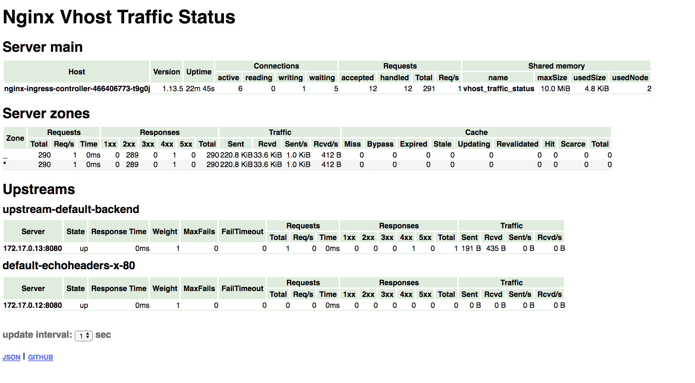
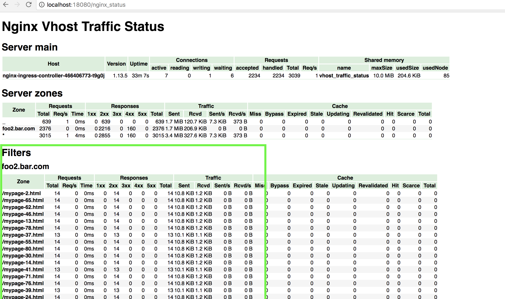
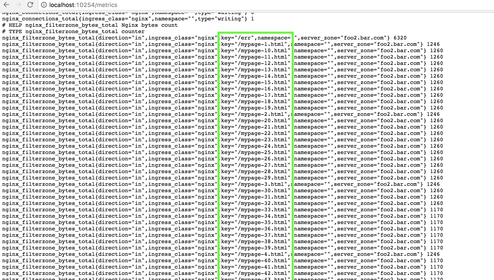

# Deploying the Nginx Ingress controller

This example aims to demonstrate the deployment of an nginx ingress controller and use a ConfigMap to enable [nginx vts module](https://github.com/vozlt/nginx-module-vts
) to export metrics in prometheus format. 

## vts-metrics 

Vts-metrics export NGINX metrics. To deploy all the files simply run `kubectl apply -f nginx`. A deployment and service will be
created which already has a `prometheus.io/scrape: 'true'` annotation and if you added
the recommended Prometheus service-endpoint scraping [configuration](https://raw.githubusercontent.com/prometheus/prometheus/master/documentation/examples/prometheus-kubernetes.yml),
Prometheus will scrape it automatically and you start using the generated metrics right away.

## Custom configuration

```console
apiVersion: v1
data:
  enable-vts-status: "true"
kind: ConfigMap
metadata:
  name: nginx-configuration
  namespace: ingress-nginx
  labels:
    app: ingress-nginx
```

```console
$ kubectl apply -f nginx-vts-metrics-conf.yaml
```

## Result

Check whether the ingress controller successfully generated the NGINX vts status:

```console
$ kubectl exec nginx-ingress-controller-873061567-4n3k2 -n ingress-nginx cat /etc/nginx/nginx.conf|grep vhost_traffic_status_display
 vhost_traffic_status_display;
 vhost_traffic_status_display_format html;
```

### NGINX vts dashboard

The vts dashboard provides real time metrics. 



Because the vts port it's not yet exposed, you should forward the controller port to see it.

```console
$ kubectl port-forward $(kubectl get pods --selector=k8s-app=nginx-ingress-controller -n ingress-nginx --output=jsonpath={.items..metadata.name}) -n ingress-nginx 18080
```

Now open the url [http://localhost:18080/nginx_status](http://localhost:18080/nginx_status) in your browser.

### Prometheus metrics output

NGINX Ingress controller already has a parser to convert vts metrics to Prometheus format. It exports prometheus metrics to the address `:10254/metrics`.

```console
$ kubectl exec -ti -n ingress-nginx $(kubectl get pods --selector=k8s-app=nginx-ingress-controller -n kube-system --output=jsonpath={.items..metadata.name}) curl localhost:10254/metrics
ingress_controller_ssl_expire_time_seconds{host="foo.bar.com"} -6.21355968e+10
# HELP ingress_controller_success Cumulative number of Ingress controller reload operations
# TYPE ingress_controller_success counter
ingress_controller_success{count="reloads"} 3
# HELP nginx_bytes_total Nginx bytes count
# TYPE nginx_bytes_total counter
nginx_bytes_total{direction="in",ingress_class="nginx",namespace="",server_zone="*"} 3708
nginx_bytes_total{direction="in",ingress_class="nginx",namespace="",server_zone="_"} 3708
nginx_bytes_total{direction="out",ingress_class="nginx",namespace="",server_zone="*"} 5256
nginx_bytes_total{direction="out",ingress_class="nginx",namespace="",server_zone="_"} 5256
```

### Customize metrics

The default [vts vhost key](https://github.com/vozlt/nginx-module-vts#vhost_traffic_status_filter_by_set_key) is `$geoip_country_code country::*` that expose metrics grouped by server and country code. The example below show how to have metrics grouped by server and server path.



##  NGINX custom configuration ( http level )

```
  apiVersion: v1
  kind: ConfigMap
  data:
    enable-vts-status: "true"
    vts-default-filter-key: "$server_name"
...
```

## Customize ingress

```
 apiVersion: extensions/v1beta1
  kind: Ingress
  metadata:
    annotations:
      ingress.kubernetes.io/vts-filter-key: $uri $server_name
    name: ingress
```

## Result 


