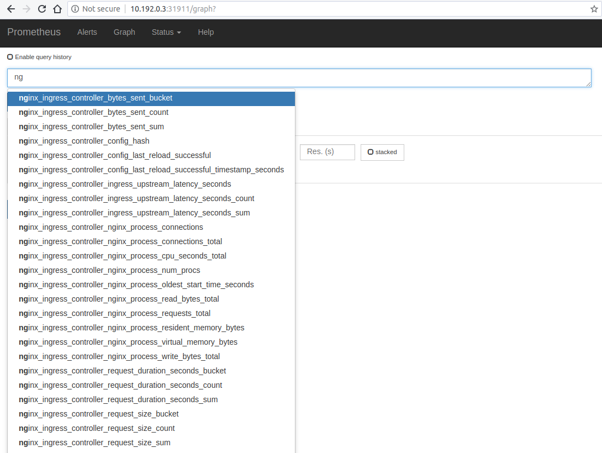
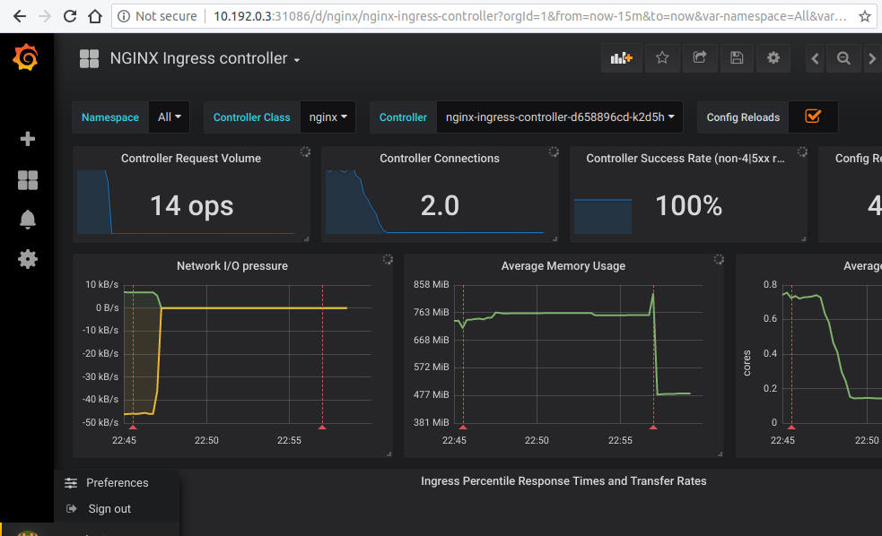

# Prometheus and Grafana installation

This tutorial will show you how to install [Prometheus](https://prometheus.io/) and [Grafana](https://grafana.com/) for scraping the metrics of the NGINX Ingress controller.

!!! important
    This example uses `emptyDir` volumes for Prometheus and Grafana. This means once the pod gets terminated you will lose all the data.

## Before You Begin

- The NGINX Ingress controller should already be deployed according to the deployment instructions [here](../deploy/index.md).

- The controller should be configured for exporting metrics. This requires 3 configurations to the controller. These configurations are :
  1. controller.metrics.enabled=true
  2. controller.podAnnotations."prometheus.io/scrape"="true"
  3. controller.podAnnotations."prometheus.io/port"="10254"

  - The easiest way to configure the controller for metrics is via helm upgrade. Assuming you have installed the ingress-nginx controller as a helm release named ingresscontroller0, then you can simply type the command show below :
  ```
  helm upgrade ingresscontroller0 ingress-nginx/ingress-nginx \
  --namespace ingress-nginx \
  --set controller.metrics.enabled=true \
  --set-string controller.podAnnotations."prometheus\.io/scrape"="true" \
  --set-string controller.podAnnotations."prometheus\.io/port"="10254"
  ```
  - You can validate that the controller is configured for metrics by looking at the values of the installed release, like this ;
  ```
  helm get values ingress-controller --namespace ingress-nginx
  ```
  - You should be able to see the values shown below ;
  ```
  ..
  controller:
    metrics:
      enabled: true
      service:
        annotations:
          prometheus.io/port: "10254"
          prometheus.io/scrape: "true" 
  ..
  ```
   - If you are **not using helm**, you will have to edit your manifests like this:
     - Service manifest:
       ```
       apiVersion: v1
       kind: Service
       metadata:
        annotations:
          prometheus.io/scrape: "true"
          prometheus.io/port: "10254"
       ..
       spec:
         ports:
           - name: prometheus
             port: 10254
             targetPort: prometheus
             ..

       ```
       
      - DaemonSet manifest:
           ```
           ..
           ports:
             - name: prometheus
               containerPort: 10254
             ..
           ```


## Deploy and configure Prometheus Server

Note that the kustomize bases used in this tutorial are stored in the [deploy](https://github.com/kubernetes/ingress-nginx/tree/main/deploy) folder of the GitHub repository [kubernetes/ingress-nginx](https://github.com/kubernetes/ingress-nginx).

- The Prometheus server must be configured so that it can discover endpoints of services. If a Prometheus server is already running in the cluster and if it is configured in a way that it can find the ingress controller pods, no extra configuration is needed.

- If there is no existing Prometheus server running, the rest of this tutorial will guide you through the steps needed to deploy a properly configured Prometheus server.

- Running the following command deploys prometheus in Kubernetes:

  ```
  kubectl apply --kustomize github.com/kubernetes/ingress-nginx/deploy/prometheus/
  ```

### Prometheus Dashboard

- Open Prometheus dashboard in a web browser:

  ```console
  kubectl get svc -n ingress-nginx
  NAME                   TYPE        CLUSTER-IP      EXTERNAL-IP   PORT(S)                                      AGE
  default-http-backend   ClusterIP   10.103.59.201   <none>        80/TCP                                       3d
  ingress-nginx          NodePort    10.97.44.72     <none>        80:30100/TCP,443:30154/TCP,10254:32049/TCP   5h
  prometheus-server      NodePort    10.98.233.86    <none>        9090:32630/TCP                               1m
  ```

  - Obtain the IP address of the nodes in the running cluster:

  ```console
  kubectl get nodes -o wide
  ```

  - In some cases where the node only have internal IP addresses we need to execute:

  ```
  kubectl get nodes --selector=kubernetes.io/role!=master -o jsonpath={.items[*].status.addresses[?\(@.type==\"InternalIP\"\)].address}
  10.192.0.2 10.192.0.3 10.192.0.4
  ```

  - Open your browser and visit the following URL: _http://{node IP address}:{prometheus-svc-nodeport}_ to load the Prometheus Dashboard.

  - According to the above example, this URL will be http://10.192.0.3:32630

  

### Grafana

  - Install grafana using the below command
  ```
  kubectl apply --kustomize github.com/kubernetes/ingress-nginx/deploy/grafana/
  ```
  - Look at the services
  ```
  kubectl get svc -n ingress-nginx
  NAME                   TYPE        CLUSTER-IP      EXTERNAL-IP   PORT(S)                                      AGE
  default-http-backend   ClusterIP   10.103.59.201   <none>        80/TCP                                       3d
  ingress-nginx          NodePort    10.97.44.72     <none>        80:30100/TCP,443:30154/TCP,10254:32049/TCP   5h
  prometheus-server      NodePort    10.98.233.86    <none>        9090:32630/TCP                               10m
  grafana                NodePort    10.98.233.87    <none>        3000:31086/TCP                               10m
  ```

  - Open your browser and visit the following URL: _http://{node IP address}:{grafana-svc-nodeport}_ to load the Grafana Dashboard.
According to the above example, this URL will be http://10.192.0.3:31086

  The username and password is `admin`

  - After the login you can import the Grafana dashboard from [official dashboards](https://github.com/kubernetes/ingress-nginx/tree/main/deploy/grafana/dashboards), by following steps given below :

    - Navigate to lefthand panel of grafana
    - Hover on the gearwheel icon for Configuration and click "Data Sources"
    - Click "Add data source"
    - Select "Prometheus"
    - Enter the details (note: I used http://CLUSTER_IP_PROMETHEUS_SVC:9090)
    - Left menu (hover over +) -> Dashboard
    - Click "Import"
    - Enter the copy pasted json from https://raw.githubusercontent.com/kubernetes/ingress-nginx/main/deploy/grafana/dashboards/nginx.json
    - Click Import JSON
    - Select the Prometheus data source
    - Click "Import"


  

## Caveats

### Wildcard ingresses

  - By default request metrics are labeled with the hostname. When you have a wildcard domain ingress, then there will be no metrics for that ingress (to prevent the metrics from exploding in cardinality). To get metrics in this case you need to run the ingress controller with `--metrics-per-host=false` (you will lose labeling by hostname, but still have labeling by ingress).

## Grafana dashboard using ingress resource
  - If you want to expose the dashboard for grafana using a ingress resource, then you can : 
    - change the service type of the prometheus-server service and the grafana service to "ClusterIP" like this :
    ```
    kubectl -n ingress-nginx edit svc grafana
    ```
    - This will open the currently deployed service grafana in the default editor configured in your shell (vi/nvim/nano/other)
    - scroll down to line 34 that looks like "type: NodePort"
    - change it to look like "type: ClusterIP". Save and exit.
    - create a ingress reource with backend as "grafana" and port as "3000"
  - Similarly, you can edit the service "prometheus-server" and add a ingress resource.
