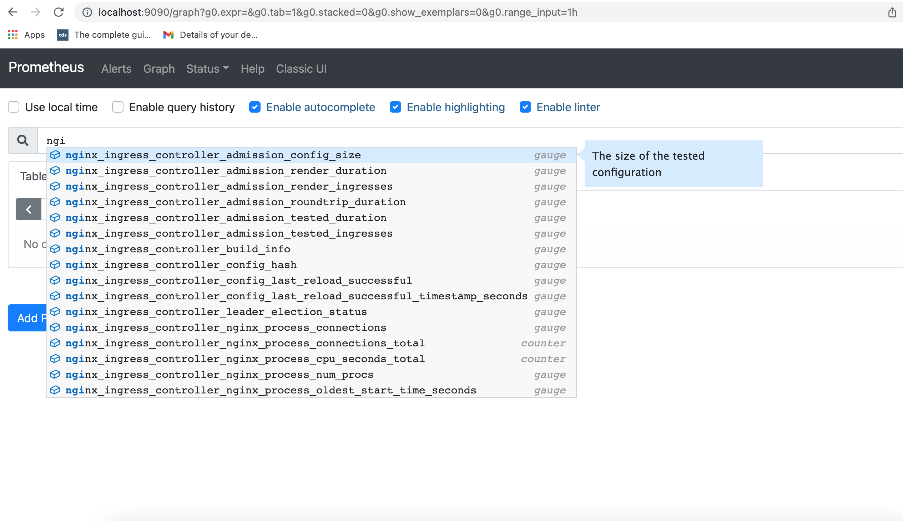
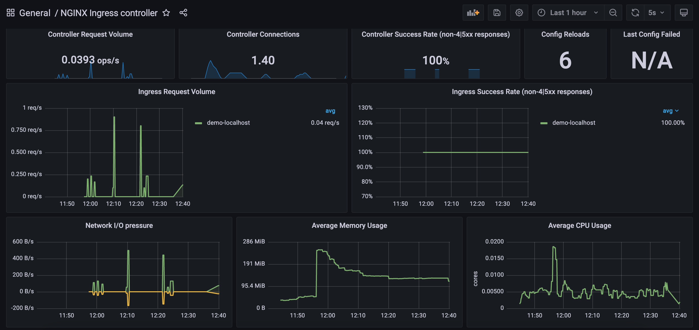

# Prometheus and Grafana installation
Two different methods to install and configure Prometheus and Grafana are described in this doc. 
- Prometheus and Grafana installation using Pod Annotations. This installs Prometheus and Grafana in the same namespace as NGINX Ingress
- Prometheus and Grafana installation using Service Monitors. This installs Prometheus and Grafana in two different namespaces. This is the preferred method, and helm charts supports this by default. 

## PROMETHEUS AND GRAFANA INSTALLATION USING POD ANNOTATIONS
This tutorial will show you how to install [Prometheus](https://prometheus.io/) and [Grafana](https://grafana.com/) for scraping the metrics of the NGINX Ingress controller.

!!! important
    This example uses `emptyDir` volumes for Prometheus and Grafana. This means once the pod gets terminated you will lose all the data.

### Before You Begin

- The NGINX Ingress controller should already be deployed according to the deployment instructions [here](../deploy/index.md).

- The controller should be configured for exporting metrics. This requires 3 configurations to the controller. These configurations are :
  1. controller.metrics.enabled=true
  2. controller.podAnnotations."prometheus.io/scrape"="true"
  3. controller.podAnnotations."prometheus.io/port"="10254"

  - The easiest way to configure the controller for metrics is via helm upgrade. Assuming you have installed the ingress-nginx controller as a helm release named ingress-controller, then you can simply type the command show below :
  ```
  helm upgrade ingress-controller ingress-nginx/ingress-nginx \
  --namespace ingress-nginx \
  --set controller.metrics.enabled=true \
  --set-string controller.podAnnotations."prometheus\.io/scrape"="true" \
  --set-string controller.podAnnotations."prometheus\.io/port"="10254"
  ```
  - You can validate that the controller is configured for metrics by looking at the values of the installed release, like this:
  ```
  helm get values ingress-controller --namespace ingress-nginx
  ```
  - You should be able to see the values shown below:
  ```
  ..
  controller:
    metrics:
      enabled: true
      service:
        annotations:
          prometheus.io/port: "10254"
          prometheus.io/scrape: "true" 
  ..
  ```
   - If you are **not using helm**, you will have to edit your manifests like this:
     - Service manifest:
       ```
       apiVersion: v1
       kind: Service
       metadata:
        annotations:
          prometheus.io/scrape: "true"
          prometheus.io/port: "10254"
       ..
       spec:
         ports:
           - name: prometheus
             port: 10254
             targetPort: prometheus
             ..

       ```
       
      - Deployment manifest:
         ```
         apiVersion: v1
         metadata:
         kind: Deployment
          annotations:
            prometheus.io/scrape: "true"
            prometheus.io/port: "10254"
         ..
         spec:
           ports:
             - name: prometheus
               port: 10254
               ..

           ```


### Deploy and configure Prometheus Server

Note that the kustomize bases used in this tutorial are stored in the [deploy](https://github.com/kubernetes/ingress-nginx/tree/main/deploy) folder of the GitHub repository [kubernetes/ingress-nginx](https://github.com/kubernetes/ingress-nginx).

- The Prometheus server must be configured so that it can discover endpoints of services. If a Prometheus server is already running in the cluster and if it is configured in a way that it can find the ingress controller pods, no extra configuration is needed.

- If there is no existing Prometheus server running, the rest of this tutorial will guide you through the steps needed to deploy a properly configured Prometheus server.

- Running the following command deploys prometheus in Kubernetes:

  ```
  kubectl apply --kustomize github.com/kubernetes/ingress-nginx/deploy/prometheus/
  ```

#### Prometheus Dashboard

- Open Prometheus dashboard in a web browser:

  ```console
  kubectl get svc -n ingress-nginx
  NAME                   TYPE        CLUSTER-IP      EXTERNAL-IP   PORT(S)                                      AGE
  default-http-backend   ClusterIP   10.103.59.201   <none>        80/TCP                                       3d
  ingress-nginx          NodePort    10.97.44.72     <none>        80:30100/TCP,443:30154/TCP,10254:32049/TCP   5h
  prometheus-server      NodePort    10.98.233.86    <none>        9090:32630/TCP                               1m
  ```

  - Obtain the IP address of the nodes in the running cluster:

  ```console
  kubectl get nodes -o wide
  ```

  - In some cases where the node only have internal IP addresses we need to execute:

  ```
  kubectl get nodes --selector=kubernetes.io/role!=master -o jsonpath={.items[*].status.addresses[?\(@.type==\"InternalIP\"\)].address}
  10.192.0.2 10.192.0.3 10.192.0.4
  ```

  - Open your browser and visit the following URL: _http://{node IP address}:{prometheus-svc-nodeport}_ to load the Prometheus Dashboard.

  - According to the above example, this URL will be http://10.192.0.3:32630

  

#### Grafana
  - Install grafana using the below command
  ```
  kubectl apply --kustomize github.com/kubernetes/ingress-nginx/deploy/grafana/
  ```
  - Look at the services
  ```
  kubectl get svc -n ingress-nginx
  NAME                   TYPE        CLUSTER-IP      EXTERNAL-IP   PORT(S)                                      AGE
  default-http-backend   ClusterIP   10.103.59.201   <none>        80/TCP                                       3d
  ingress-nginx          NodePort    10.97.44.72     <none>        80:30100/TCP,443:30154/TCP,10254:32049/TCP   5h
  prometheus-server      NodePort    10.98.233.86    <none>        9090:32630/TCP                               10m
  grafana                NodePort    10.98.233.87    <none>        3000:31086/TCP                               10m
  ```

  - Open your browser and visit the following URL: _http://{node IP address}:{grafana-svc-nodeport}_ to load the Grafana Dashboard.
According to the above example, this URL will be http://10.192.0.3:31086

  The username and password is `admin`

  - After the login you can import the Grafana dashboard from [official dashboards](https://github.com/kubernetes/ingress-nginx/tree/main/deploy/grafana/dashboards), by following steps given below :

    - Navigate to lefthand panel of grafana
    - Hover on the gearwheel icon for Configuration and click "Data Sources"
    - Click "Add data source"
    - Select "Prometheus"
    - Enter the details (note: I used http://CLUSTER_IP_PROMETHEUS_SVC:9090)
    - Left menu (hover over +) -> Dashboard
    - Click "Import"
    - Enter the copy pasted json from https://raw.githubusercontent.com/kubernetes/ingress-nginx/main/deploy/grafana/dashboards/nginx.json
    - Click Import JSON
    - Select the Prometheus data source
    - Click "Import"


  

### Caveats

#### Wildcard ingresses

  - By default request metrics are labeled with the hostname. When you have a wildcard domain ingress, then there will be no metrics for that ingress (to prevent the metrics from exploding in cardinality). To get metrics in this case you need to run the ingress controller with `--metrics-per-host=false` (you will lose labeling by hostname, but still have labeling by ingress).

### Grafana dashboard using ingress resource
  - If you want to expose the dashboard for grafana using a ingress resource, then you can : 
    - change the service type of the prometheus-server service and the grafana service to "ClusterIP" like this :
    ```
    kubectl -n ingress-nginx edit svc grafana
    ```
    - This will open the currently deployed service grafana in the default editor configured in your shell (vi/nvim/nano/other)
    - scroll down to line 34 that looks like "type: NodePort"
    - change it to look like "type: ClusterIP". Save and exit.
    - create a ingress resource with backend as "grafana" and port as "3000"
  - Similarly, you can edit the service "prometheus-server" and add a ingress resource.

## PROMETHEUS AND GRAFANA INSTALLATION USING SERVICE MONITORS
This document assumes you're using helm and using the kube-prometheus-stack package to install Prometheus and Grafana. 

### Verify NGINX Ingress controller is installed

- The NGINX Ingress controller should already be deployed according to the deployment instructions [here](../deploy/index.md).

- To check if Ingress controller is deployed, 
  ```
  kubectl get pods -n ingress-nginx 
  ```
- The result should look something like: 
  ```
  NAME                                        READY   STATUS    RESTARTS   AGE
  ingress-nginx-controller-7c489dc7b7-ccrf6   1/1     Running   0          19h
    ```

### Verify Prometheus is installed

- To check if Prometheus is already deployed, run the following command:

  ```
  helm ls -A
  ```
  ```
  NAME         	NAMESPACE    	REVISION	UPDATED                             	STATUS  	CHART                       	APP VERSION
  ingress-nginx	ingress-nginx	10      	2022-01-20 18:08:55.267373 -0800 PST	deployed	ingress-nginx-4.0.16        	1.1.1      
  prometheus   	prometheus   	1       	2022-01-20 16:07:25.086828 -0800 PST	deployed	kube-prometheus-stack-30.1.0	0.53.1  
  ```
- Notice that prometheus is installed in a differenet namespace than ingress-nginx

- If prometheus is not installed, then you can install from [here](https://artifacthub.io/packages/helm/prometheus-community/kube-prometheus-stack)

### Re-configure NGINX Ingress controller

- The Ingress NGINX controller needs to be reconfigured for exporting metrics. This requires 3 additional configurations to the controller. These configurations are :
  ```
  controller.metrics.enabled=true
  controller.metrics.serviceMonitor.enabled=true
  controller.metrics.serviceMonitor.additionalLabels.release="prometheus" 
  ```
- The easiest way of doing this is to helm upgrade 
  ```
  helm upgrade ingress-nginx ingress-nginx/ingress-nginx \
  --namespace ingress-nginx \
  --set controller.metrics.enabled=true \
  --set controller.metrics.serviceMonitor.enabled=true \
  --set controller.metrics.serviceMonitor.additionalLabels.release="prometheus"
  ```
- Here `controller.metrics.serviceMonitor.additionalLabels.release="prometheus"` should match the name of the helm release of the `kube-prometheus-stack`

- You can validate that the controller has been successfully reconfigured to export metrics by looking at the values of the installed release, like this:
  ```
  helm get values ingress-nginx --namespace ingress-nginx
  ```
  ```
  controller:
    metrics:
      enabled: true
      serviceMonitor:
        additionalLabels:
          release: prometheus
        enabled: true
  ```
### Configure Prometheus

- Since Prometheus is running in a different namespace and not in the ingress-nginx namespace, it would not be able to discover ServiceMonitors in other namespaces when installed. Reconfigure your kube-prometheus-stack Helm installation to set `serviceMonitorSelectorNilUsesHelmValues` flag to false. By default, Prometheus only discovers PodMonitors within its own namespace. This should be disabled by setting `podMonitorSelectorNilUsesHelmValues` to false
- The configurations required are:
  ```
  prometheus.prometheusSpec.podMonitorSelectorNilUsesHelmValues=false 
  prometheus.prometheusSpec.serviceMonitorSelectorNilUsesHelmValues=false
  ```
- The easiest way of doing this is to use `helm upgrade ...`
  ```
  helm upgrade prometheus prometheus-community/kube-prometheus-stack \
  --namespace prometheus  \
  --set prometheus.prometheusSpec.podMonitorSelectorNilUsesHelmValues=false \
  --set prometheus.prometheusSpec.serviceMonitorSelectorNilUsesHelmValues=false
  ```
- You can validate that Prometheus has been reconfigured by looking at the values of the installed release, like this:
  ```
  helm get values prometheus --namespace prometheus
  ```
- You should be able to see the values shown below:
  ```
  prometheus:
    prometheusSpec:
      podMonitorSelectorNilUsesHelmValues: false
      serviceMonitorSelectorNilUsesHelmValues: false
  ```

### Connect and view Prometheus dashboard
- Port forward to Prometheus service. Find out the name of the prometheus service by using the following command: 
  ```
  kubectl get svc -n prometheus
  ```

  The result of this command would look like: 
  ```
  NAME                                      TYPE        CLUSTER-IP       EXTERNAL-IP   PORT(S)                      AGE
  alertmanager-operated                     ClusterIP   None             <none>        9093/TCP,9094/TCP,9094/UDP   7h46m
  prometheus-grafana                        ClusterIP   10.106.28.162    <none>        80/TCP                       7h46m
  prometheus-kube-prometheus-alertmanager   ClusterIP   10.108.125.245   <none>        9093/TCP                     7h46m
  prometheus-kube-prometheus-operator       ClusterIP   10.110.220.1     <none>        443/TCP                      7h46m
  prometheus-kube-prometheus-prometheus     ClusterIP   10.102.72.134    <none>        9090/TCP                     7h46m
  prometheus-kube-state-metrics             ClusterIP   10.104.231.181   <none>        8080/TCP                     7h46m
  prometheus-operated                       ClusterIP   None             <none>        9090/TCP                     7h46m
  prometheus-prometheus-node-exporter       ClusterIP   10.96.247.128    <none>        9100/TCP                     7h46m
  ```
  prometheus-kube-prometheus-prometheus is the service we want to port forward to. We can do so using the following command:
  ```
  kubectl port-forward svc/prometheus-kube-prometheus-prometheus -n prometheus 9090:9090
  ```
  When you run the above command, you should see something like: 
  ```
  Forwarding from 127.0.0.1:9090 -> 9090
  Forwarding from [::1]:9090 -> 9090
  ```
- Open your browser and visit the following URL http://localhost:{port-forwarded-port} according to the above example it would be, http://localhost:9090
  
  

### Connect and view Grafana dashboard 
- Port forward to Grafana service. Find out the name of the Grafana service by using the following command: 
  ```
  kubectl get svc -n prometheus
  ```

  The result of this command would look like: 
  ```
  NAME                                      TYPE        CLUSTER-IP       EXTERNAL-IP   PORT(S)                      AGE
  alertmanager-operated                     ClusterIP   None             <none>        9093/TCP,9094/TCP,9094/UDP   7h46m
  prometheus-grafana                        ClusterIP   10.106.28.162    <none>        80/TCP                       7h46m
  prometheus-kube-prometheus-alertmanager   ClusterIP   10.108.125.245   <none>        9093/TCP                     7h46m
  prometheus-kube-prometheus-operator       ClusterIP   10.110.220.1     <none>        443/TCP                      7h46m
  prometheus-kube-prometheus-prometheus     ClusterIP   10.102.72.134    <none>        9090/TCP                     7h46m
  prometheus-kube-state-metrics             ClusterIP   10.104.231.181   <none>        8080/TCP                     7h46m
  prometheus-operated                       ClusterIP   None             <none>        9090/TCP                     7h46m
  prometheus-prometheus-node-exporter       ClusterIP   10.96.247.128    <none>        9100/TCP                     7h46m
  ```
  prometheus-grafana is the service we want to port forward to. We can do so using the following command:
  ```
  kubectl port-forward svc/prometheus-grafana  3000:80 -n prometheus
  ```
  When you run the above command, you should see something like: 
  ```
  Forwarding from 127.0.0.1:3000 -> 3000
  Forwarding from [::1]:3000 -> 3000
  ```
- Open your browser and visit the following URL http://localhost:{port-forwarded-port} according to the above example it would be, http://localhost:3000
  The default username/ password is admin/prom-operator
- After the login you can import the Grafana dashboard from [official dashboards](https://github.com/kubernetes/ingress-nginx/tree/main/deploy/grafana/dashboards), by following steps given below :

  - Navigate to lefthand panel of grafana
  - Hover on the gearwheel icon for Configuration and click "Data Sources"
  - Click "Add data source"
  - Select "Prometheus"
  - Enter the details (note: I used http://10.102.72.134:9090 which is the CLUSTER-IP for Prometheus service)
  - Left menu (hover over +) -> Dashboard
  - Click "Import"
  - Enter the copy pasted json from https://raw.githubusercontent.com/kubernetes/ingress-nginx/main/deploy/grafana/dashboards/nginx.json
  - Click Import JSON
  - Select the Prometheus data source
  - Click "Import"

  
 
